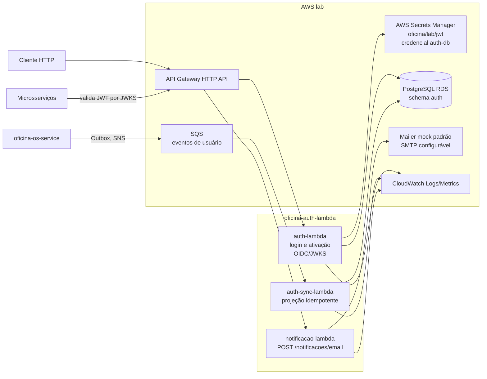

# oficina-auth-lambda

## Propósito

Lambdas da suíte Oficina para autenticação, ativação de credenciais, sincronização assíncrona de usuários operacionais, emissão de JWT, publicação de metadados OIDC/JWKS e envio de notificações por e-mail. O repositório é multi-módulo Maven, gera artefatos nativos Quarkus para AWS Lambda e integra HTTP API Gateway, SQS, PostgreSQL e Secrets Manager no laboratório.

## Tecnologias utilizadas

- Java 25
- Quarkus 3.31.x
- Maven Wrapper multi-módulo
- Quarkus REST, Amazon Lambda HTTP e SmallRye OpenAPI/Swagger UI
- SmallRye JWT e BCrypt
- Panache/Hibernate ORM e JDBC para autenticação e projeção de usuários no PostgreSQL
- Quarkus Mailer para notificação
- AWS Lambda, API Gateway HTTP API, SNS/SQS, Secrets Manager, S3 e VPC
- OpenTelemetry, Micrometer e logs JSON
- GitHub Actions e scripts Bash em `scripts/`

## Deploy e teste da suíte

O deploy integrado deve começar pelo repositório unificado `../oficina-infra`, que provisiona RDS, SNS/SQS, policies e workloads Kubernetes. Depois de promover as mudanças necessárias para `main`, execute:

```text
oficina-infra -> Actions -> Deploy Lab -> Run workflow
```

Quando a infraestrutura terminar, execute `Deploy Lambda Lab` neste repositório para publicar as funções e criar os event source mappings. Essa ordem garante que as filas e a policy consumidora da `oficina-auth-sync-lambda` existam antes da função. Os repositórios legados `oficina-infra-db` e `oficina-infra-k8s` são somente fontes históricas e não participam do fluxo canônico.

Depois que todos os workflows terminarem, valide as rotas e integrações da suíte a partir dos testes de aceitação disponíveis nos repositórios consumidores.

## Arquitetura

- `auth-lambda`
  - autenticação por CPF e senha
  - solicitação administrativa e consumo público de token de ativação de credencial
  - emissão de JWT
  - endpoints `POST /auth`, `POST /auth/token`, `POST /auth/usuarios/{usuarioId}/ativacao`, `POST /auth/ativacoes`, `GET /.well-known/openid-configuration` e `GET /.well-known/jwks.json`
  - integração com PostgreSQL/RDS e AWS Secrets Manager
- `auth-sync-lambda`
  - consumo SQS de `usuarioAdicionado`, `usuarioAtualizado` e `usuarioExcluido`
  - projeção idempotente de CPF, nome, status e papéis, sem alterar credenciais
  - descarte de snapshots obsoletos pelo `occurredAt`, pois os tipos de evento usam filas distintas
- `auth-common`
  - resolução compartilhada de configuração pelo AWS Secrets Manager
- `notificacao-lambda`
  - envio de e-mail
  - endpoint `POST /notificacoes/email`
  - sem acoplamento direto com banco/JWT



## Estrutura do repositório

- `pom.xml`: POM pai com versão única do repositório
- `auth-common/`: configuração compartilhada de Secrets Manager
- `auth-lambda/`: aplicação Quarkus da Lambda de autenticação
- `auth-sync-lambda/`: consumidor SQS que projeta usuários operacionais no store de autenticação
- `notificacao-lambda/`: aplicação Quarkus da Lambda de notificação
- `scripts/`: automação de build nativo, cache S3, deploy, cleanup local e detecção de impacto
- `.github/workflows/`: build/deploy do laboratório
- `docs/github-actions.md`: convenções operacionais dos workflows

## Contratos HTTP preservados

Auth:

```text
POST /auth
POST /auth/token
POST /auth/usuarios/{usuarioId}/ativacao
POST /auth/ativacoes
GET /.well-known/openid-configuration
GET /.well-known/jwks.json
```

Notificação:

```text
POST /notificacoes/email
```

O endpoint administrativo de ativação exige o papel `administrativo`; ele emite um token aleatório de uso único, persistido somente como hash SHA-256 e válido por 24 horas por padrão. O endpoint público recebe o token e uma senha entre 12 e 128 caracteres. Usuários `INATIVO`, `BLOQUEADO` ou ainda sem credencial não autenticam. O endpoint de notificação não é publicado pelo mesmo runtime da autenticação, e a `auth-sync-lambda` não possui rota HTTP.

## Swagger, OpenAPI e Postman

Os módulos expõem Swagger UI/OpenAPI no modo Quarkus dev. Não há coleção Postman versionada neste repositório; importe os documentos OpenAPI abaixo no Postman quando precisar de uma coleção.

- Auth local:
  - Swagger UI: `http://localhost:9080/q/swagger-ui/`
  - OpenAPI: `http://localhost:9080/q/openapi`
- Notificação local:
  - Swagger UI: `http://localhost:9082/q/swagger-ui/`
  - OpenAPI: `http://localhost:9082/q/openapi`
- Lab via API Gateway:
  - Auth/JWKS: `<OFICINA_AUTH_ISSUER>/.well-known/jwks.json`
  - OpenID metadata: `<OFICINA_AUTH_ISSUER>/.well-known/openid-configuration`
  - Swagger/OpenAPI das Lambdas só fica disponível no lab se as rotas `/q/swagger-ui/*` e `/q/openapi` forem explicitamente publicadas no API Gateway.

## Observabilidade

O módulo `auth-lambda` já está preparado para observabilidade vendor-neutral:

- `service.name=oficina-auth-lambda`
- `service.namespace=oficina`
- `deployment.environment=lab` por padrão
- logs estruturados em JSON com correlação por `request_id`, `trace_id` e `span_id`
- tracing distribuído com OpenTelemetry, incluindo span interno do fluxo de autenticação
- métricas de autenticação:
  - `auth_requests_total`
  - `auth_failures_total`
  - `auth_latency_ms`

Env vars padronizadas:

- `OTEL_SERVICE_NAME`
- `OTEL_RESOURCE_ATTRIBUTES`
- `OTEL_EXPORTER_OTLP_ENDPOINT`
- `OTEL_EXPORTER_OTLP_PROTOCOL`
- `OTEL_TRACES_EXPORTER`
- `OTEL_METRICS_EXPORTER`
- `OTEL_LOGS_EXPORTER`
- `OFICINA_OBSERVABILITY_ENABLED`
- `OFICINA_OBSERVABILITY_JSON_LOGS_ENABLED`
- `OFICINA_OBSERVABILITY_METRICS_ENABLED`
- `OFICINA_OBSERVABILITY_TRACING_ENABLED`
- `DEPLOYMENT_ENVIRONMENT`

No deploy da Lambda, esse bloco pode ser injetado em `AUTH_LAMBDA_EXTRA_ENV_JSON` quando for necessário sobrescrever os defaults do código.

## Versionamento e artefatos

- a versão continua única no repositório e fica no `pom.xml` pai
- `main` não publica `-SNAPSHOT`
- o build nativo fechado fica no S3, em prefixos versionados por módulo
- se a versão atual já possui artefatos no S3 e a Lambda já está alinhada, a action não rebuilda nem redeploya
- no deploy, pacotes maiores que `DIRECT_ZIP_UPLOAD_MAX_BYTES` usam o bucket de artefatos e `--s3-bucket/--s3-key`, evitando o limite de upload direto da API Lambda
- para runtimes `provided.*`, o deploy valida se o ZIP contém `bootstrap` na raiz e usa o pacote nativo nomeado quando `function.zip` tiver sido sobrescrito por build JVM local
- quando o estado da AWS exigir novo build em `main`, o push precisa trazer incremento de versão no `pom.xml`

Como o `pom.xml` pai é comum, uma nova versão publicada normalmente gera artefatos versionados para as três Lambdas.

## Detecção de impacto por módulo

A detecção fica em `scripts/detect-lambda-impacts.sh`.

Impacta `auth-lambda`:

- alterações em `auth-lambda/**`
- alterações em `auth-common/**`

Impacta `auth-sync-lambda`:

- alterações em `auth-sync-lambda/**`
- alterações em `auth-common/**`

Impacta `notificacao-lambda`:

- alterações em `notificacao-lambda/**`

Impacta as três Lambdas:

- `pom.xml`
- `mvnw`, `mvnw.cmd`, `.mvn/**`
- `scripts/**`
- `.github/workflows/**`

Mudanças apenas em documentação não disparam build nativo nem deploy.

## Desenvolvimento local

Auth:

```bash
./scripts/generate-dev-jwt-keys.sh
./mvnw -pl auth-lambda quarkus:dev
```

- mock event server: `http://localhost:9080`

Notificação:

```bash
./mvnw -pl notificacao-lambda quarkus:dev
```

- mock event server: `http://localhost:9082`

Sincronização de usuários:

```bash
./mvnw -pl auth-sync-lambda test
```

O teste de integração sobe PostgreSQL real por Testcontainers e cobre criação, atualização, inativação, adoção de seed, idempotência, reordenação e resposta parcial de lote SQS.

## Build nativo por módulo

```bash
./scripts/build-native-lambda.sh auth-lambda
./scripts/build-native-lambda.sh auth-sync-lambda
./scripts/build-native-lambda.sh notificacao-lambda
```

Artefatos gerados:

- `auth-lambda/target/function.zip`
- `auth-lambda/target/oficina-auth-lambda-native.zip`
- `auth-sync-lambda/target/function.zip`
- `auth-sync-lambda/target/oficina-auth-sync-lambda-native.zip`
- `notificacao-lambda/target/function.zip`
- `notificacao-lambda/target/oficina-notificacao-lambda-native.zip`

## Deploy por módulo

```bash
./scripts/deploy-native-lambda.sh auth-lambda
./scripts/deploy-native-lambda.sh auth-sync-lambda
./scripts/deploy-native-lambda.sh notificacao-lambda
```

Defaults operacionais:

- `auth-lambda`
  - função padrão: `oficina-auth-lambda-lab`
  - prefixo S3 padrão: `oficina/lab/lambda/oficina-auth-lambda`
  - anexa VPC por padrão
  - usa `DB_NAME=app` como fallback quando o RDS não informa `DBName`
  - emite JWT com `aud` para `oficina-os-service`, `oficina-billing-service` e `oficina-execution-service` por padrão; `OFICINA_AUTH_AUDIENCE` aceita lista separada por vírgula, ponto-e-vírgula ou espaço
  - continua bootstrapando usuário, schema e seed mínimo do RDS por Job efêmero no EKS e reutilizando `JWT_SECRET_NAME=oficina/lab/jwt`
- `auth-sync-lambda`
  - função padrão: `oficina-auth-sync-lambda-lab`
  - prefixo S3 padrão: `oficina/lab/lambda/oficina-auth-sync-lambda`
  - anexa VPC por padrão e reutiliza a credencial do database de autenticação
  - cria event source mappings para as três filas de eventos de usuário com `ReportBatchItemFailures`
  - não executa bootstrap do schema nem se conecta ao API Gateway
- `notificacao-lambda`
  - função padrão: `oficina-notificacao-lambda-lab`
  - prefixo S3 padrão: `oficina/lab/lambda/oficina-notificacao-lambda`
  - anexa VPC por padrão no ambiente `lab`
  - usa por padrão `NOTIFICACAO_LAMBDA_EXTRA_ENV_JSON={"QUARKUS_MAILER_FROM":"noreply@oficina.local","QUARKUS_MAILER_PORT":"1025","QUARKUS_MAILER_TLS":"false","QUARKUS_MAILER_START_TLS":"DISABLED"}`
  - tenta resolver automaticamente o host privado do MailHog no deploy; quando o NLB não existe, habilita `QUARKUS_MAILER_MOCK=true` para não bloquear o ciclo de publicação do `lab`
  - quando sobrescrito para SMTP real externo, exige `QUARKUS_MAILER_FROM`; quando `QUARKUS_MAILER_MOCK` não for `true`, também exige `QUARKUS_MAILER_HOST`

Para configs específicas da função, os workflows e scripts usam nomes separados por Lambda, por exemplo:

- `AUTH_LAMBDA_FUNCTION_NAME`
- `AUTH_LAMBDA_ROLE_ARN` ou `AUTH_LAMBDA_ROLE_NAME`
- `AUTH_API_GATEWAY_ROUTE_KEYS`
- `AUTH_LAMBDA_ARTIFACT_PREFIX`
- `DB_NAME`
- `AUTH_DB_BOOTSTRAP_MODE`
- `BOOTSTRAP_AUTH_DB_SCHEMA`
- `OFICINA_AUTH_ACTIVATION_TTL_HOURS` (padrão `24`, intervalo aceito de 1 a 168 horas)
- `AUTH_SYNC_LAMBDA_FUNCTION_NAME`
- `AUTH_SYNC_LAMBDA_ROLE_ARN` ou `AUTH_SYNC_LAMBDA_ROLE_NAME`
- `AUTH_SYNC_LAMBDA_SQS_QUEUE_NAMES`
- `AUTH_SYNC_LAMBDA_SQS_BATCH_SIZE`
- `AUTH_SYNC_LAMBDA_ARTIFACT_PREFIX`
- `NOTIFICACAO_LAMBDA_FUNCTION_NAME`
- `NOTIFICACAO_LAMBDA_ROLE_ARN` ou `NOTIFICACAO_LAMBDA_ROLE_NAME`
- `NOTIFICACAO_API_GATEWAY_ROUTE_KEYS`
- `NOTIFICACAO_LAMBDA_ARTIFACT_PREFIX`
- `NOTIFICACAO_LAMBDA_EXTRA_ENV_JSON`

No workflow de `lab`, `*_LAMBDA_ROLE_NAME` usa `LabRole` como default. Se `*_LAMBDA_ROLE_ARN` ainda apontar para uma conta AWS anterior, o script resolve automaticamente uma role com o mesmo nome na conta atual antes de criar a função.

O JSON extra é mesclado nas env vars da Lambda e o script mantém uma lista de chaves gerenciadas para remover configs antigas em deploys seguintes.

O deploy da `auth-lambda` usa `AUTH_DB_BOOTSTRAP_MODE=k8s` no workflow de `lab`, criando um Job temporário com `postgres:16` dentro do EKS para executar o `psql` contra o RDS privado. Use `AUTH_DB_BOOTSTRAP_MODE=local` apenas em execução manual a partir de uma rede com rota direta para o endpoint do RDS. O modo `auto` usa `k8s` em GitHub Actions quando `EKS_CLUSTER_NAME` está definido e `local` nos demais casos. Por padrão, `BOOTSTRAP_AUTH_DB_SCHEMA=true` cria as tabelas `pessoa`, `papel`, `usuario`, `usuario_papel`, `credencial_ativacao` e `evento_processado`, além do seed mínimo de usuários do laboratório. A `auth-sync-lambda` é implantada em seguida e reutiliza esse schema.

Se `NOTIFICACAO_LAMBDA_EXTRA_ENV_JSON` não for informado, o deploy da `notificacao-lambda` em `lab` assume este fallback seguro:

```json
{
  "QUARKUS_MAILER_FROM": "noreply@oficina.local",
  "QUARKUS_MAILER_PORT": "1025",
  "QUARKUS_MAILER_TLS": "false",
  "QUARKUS_MAILER_START_TLS": "DISABLED"
}
```

Nesse modo, o script de deploy tenta descobrir o DNS privado do NLB interno `${EKS_CLUSTER_NAME}-mailhog-smtp` e injeta `QUARKUS_MAILER_HOST` automaticamente quando o NLB existe. Quando o NLB padrão não existe, o deploy injeta `QUARKUS_MAILER_MOCK=true` e segue sem SMTP real. Se `NOTIFICACAO_MAILHOG_NLB_NAME` for informado explicitamente, ou se `QUARKUS_MAILER_MOCK=false` for informado sem `QUARKUS_MAILER_HOST`, a ausência do host continua falhando cedo.

Exemplo para envio real:

```json
{
  "QUARKUS_MAILER_FROM": "noreply@oficina.example.com",
  "QUARKUS_MAILER_HOST": "smtp.oficina.example.com",
  "QUARKUS_MAILER_PORT": "587",
  "QUARKUS_MAILER_START_TLS": "REQUIRED",
  "QUARKUS_MAILER_USERNAME": "smtp-user",
  "QUARKUS_MAILER_PASSWORD": "smtp-password"
}
```

Exemplo para smoke test sem SMTP real:

```json
{
  "QUARKUS_MAILER_FROM": "noreply@oficina.example.com",
  "QUARKUS_MAILER_MOCK": "true"
}
```

## CI/CD

Resumo do fluxo:

- `develop`
  - roda `test`, `verify -DskipITs=false` e `bash -n scripts/*.sh`
  - cria ou atualiza o PR automático `develop -> main`
  - não faz build nativo
- `main`
  - consulta o S3 e a configuração das Lambdas na AWS
  - builda nativamente apenas os artefatos versionados ausentes
  - cria a Lambda quando a função ainda não existe
  - atualiza a Lambda quando a versão registrada em `OFICINA_LAMBDA_ARTIFACT_VERSION` não bate com o `pom.xml`
  - falha antes do build se a AWS exigir novo artefato e o push em `main` não tiver incrementado a versão

O workflow também pode ser executado manualmente em `main`, com `lambda_target=all|auth-lambda|notificacao-lambda`.

Detalhes operacionais: [docs/github-actions.md](docs/github-actions.md)

## Operações manuais

Build/deploy idempotente:

```text
Actions -> Deploy Lambda Lab -> Run workflow -> lambda_target=all|auth-lambda|notificacao-lambda
```

## Validação local

```bash
./mvnw test
./mvnw verify -DskipITs=false
bash -n scripts/*.sh
```
